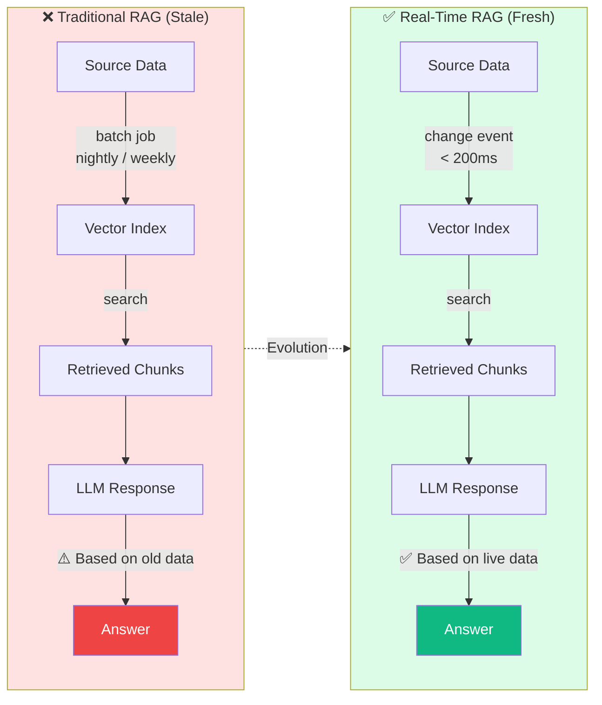
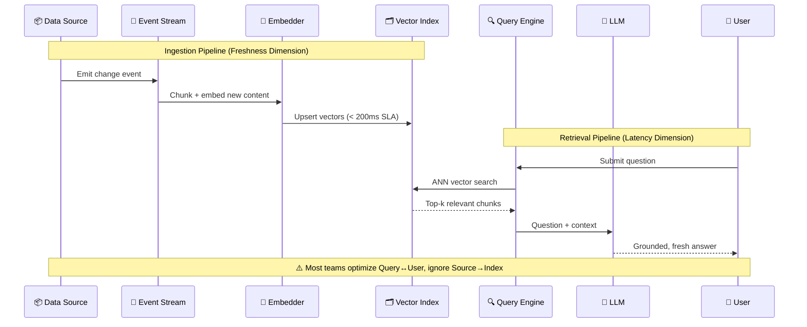
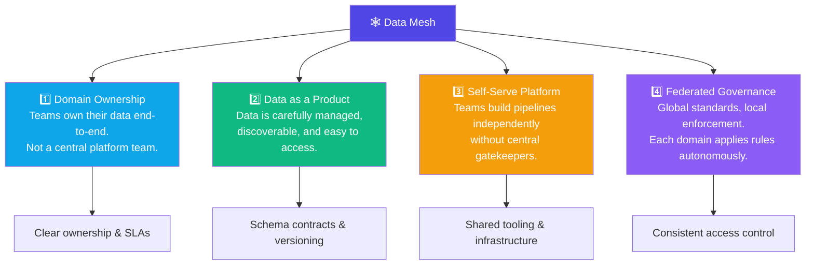
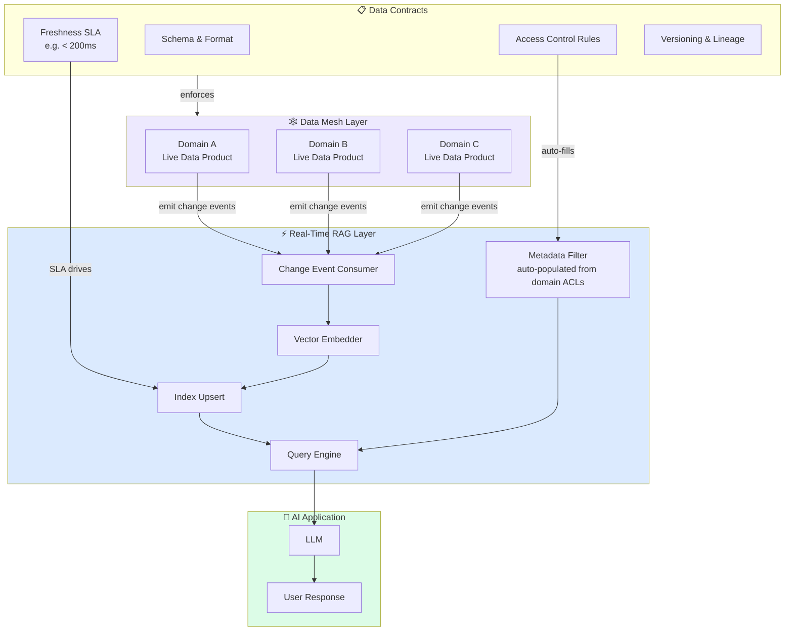
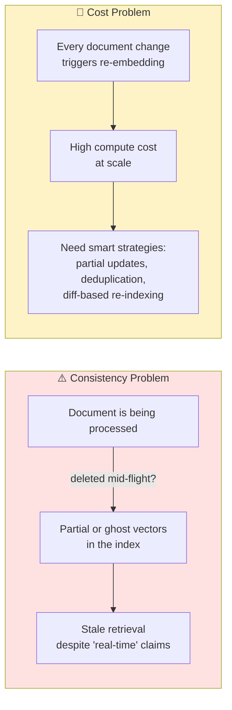

# Real-Time RAG and The Data Mesh Evolution

Real-time RAG and data mesh are changing how companies build AI systems.

---

## The Problem with Traditional RAG

Traditional RAG works by indexing documents and then searching them. The core problem: **information changes constantly** — price updates, new regulations, live inventory. If the index is stale, answers will be stale too.

---

## How Real-Time RAG Works

Real-time RAG focuses on two dimensions: **query latency** (how fast you retrieve) and **index freshness** (how quickly new data is ingested). Most teams optimize only the first and neglect the second.

---

## The Data Mesh Solution

When one central team controls all data, problems emerge: the team becomes a bottleneck, data quality drops because domain experts don't own it, and governance becomes inconsistent.

**Data mesh** solves this with four key principles:

---

## Convergence: Real-Time RAG × Data Mesh

The most powerful insight: **Real-time RAG benefits enormously from a data mesh foundation.** Here's how the two architectures reinforce each other:

### Why This Matters

| Challenge | Without Data Mesh | With Data Mesh |
|-----------|------------------|----------------|
| **Data freshness** | Fragile, ad-hoc ETL jobs | Change events via contracts (< 200ms SLA) |
| **Access control** | Manually managed per source | Auto-populated from domain ACL rules |
| **Source reliability** | Brittle one-off connectors | Versioned data products with owners |
| **Index consistency** | Unknown when data was last updated | Contractual freshness guarantees |

---

## Remaining Hard Problems

Even with data mesh as a foundation, two challenges remain:

> **Key insight:** With a data mesh, real-time RAG gains something critical — data sources that behave like **APIs**: with contracts, versioning, and accountable owners. This transforms RAG from a fragile data pipeline into a reliable, production-grade system.

---