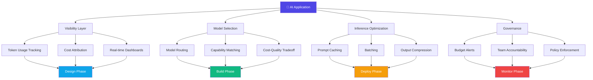
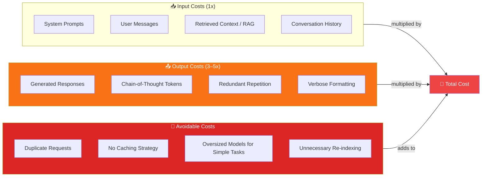
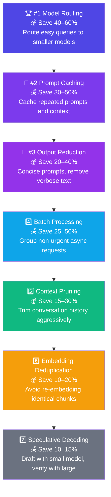
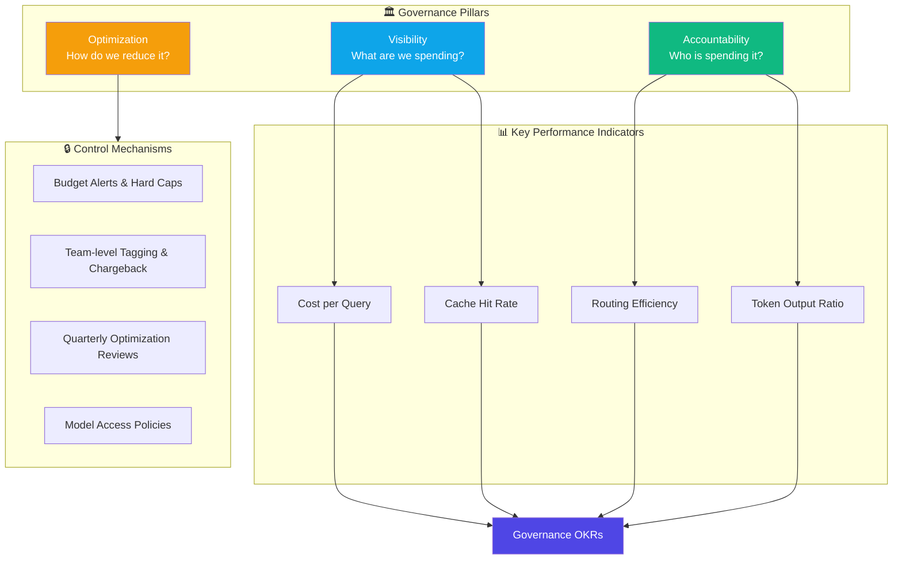
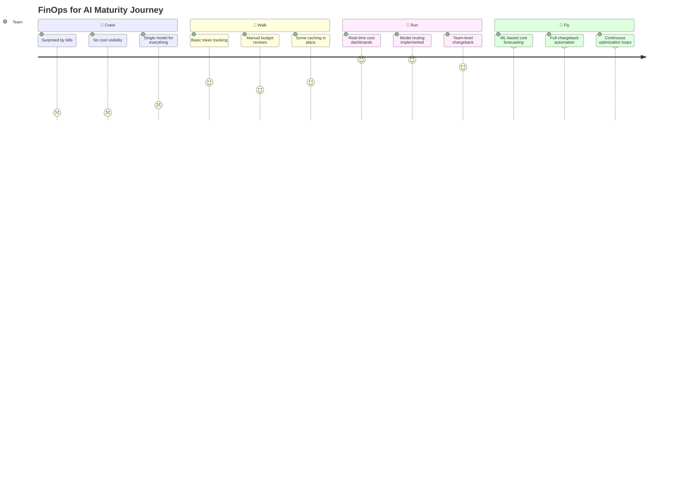

# FinOps for AI: Architecting for Cost-Efficiency

This interactive FinOps for AI framework helps you understand and save money on AI.

---

## Framework Overview

The framework has four main parts: **visibility**, **model selection**, **inference optimization**, and **governance**. It maps each action from designing applications to monitoring them.



---

## Cost Drivers

Where do AI costs come from? The main culprits are token volume and unnecessary API calls. A key insight: **output tokens are 3–5× more expensive than input tokens**.



---

## Tactics — 7 Ways to Save (Ranked by Impact)

Seven cost-saving tactics ranked by potential savings:



> 💡 **Recommended starting point:** Model routing. A simple classifier to send easy queries to a smaller model delivers a fast ROI with minimal quality risk.

---

## Governance

A solid AI FinOps governance model rests on three pillars: **visibility**, **accountability**, and **optimization**.



### Key KPIs Every Team Should Track

| KPI | Description | Target |
|-----|-------------|--------|
| **Cost per Query** | Total spend ÷ number of LLM calls | Trending down |
| **Cache Hit Rate** | % of requests served from cache | > 40% |
| **Routing Efficiency** | % of queries correctly routed to cheaper models | > 60% |
| **Token Output Ratio** | Output tokens ÷ input tokens | < 1.5 |

---

## Maturity Model

Four stages of FinOps for AI maturity — from reactive to proactive:



| Stage | Name | Key Characteristics |
|-------|------|---------------------|
| 1 | **Crawl** | Bill shock, no visibility, single model for all tasks |
| 2 | **Walk** | Basic tracking, manual reviews, early caching |
| 3 | **Run** | Dashboards, model routing, team-level accountability |
| 4 | **Fly** | ML forecasting, full chargeback, automated optimization |

---

## Savings Calculator

Use this formula to estimate your projected annual savings:

```
Annual Savings =
  (Monthly Spend × Cache Hit Rate × 0.85)
  + (Monthly Spend × Routing Coverage × 0.50)
  + (Monthly Spend × Batchable Workload × 0.40)
  + (Monthly Spend × Output Reduction Target × 0.30)
  × 12
```

**Example inputs:**

| Parameter | Example Value |
|-----------|---------------|
| Monthly AI Spend | $10,000 |
| Cache Hit Rate | 35% |
| Routing Coverage | 55% |
| Batchable Workload | 20% |
| Output Reduction Target | 15% |

> **💡 Best ROI:** Start with model routing — use a simple classifier to send easy queries to a smaller, cheaper model first. Low risk, fast payback.

---