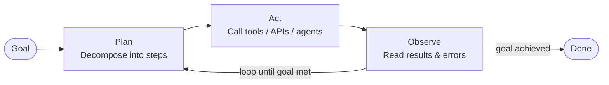
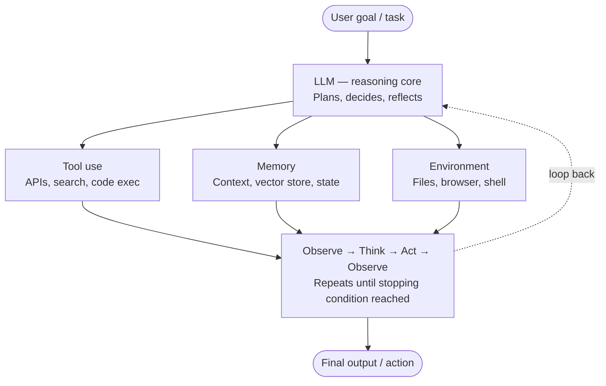
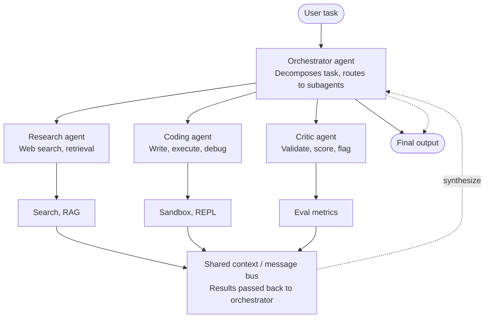
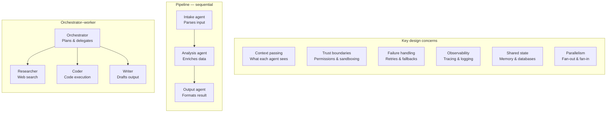
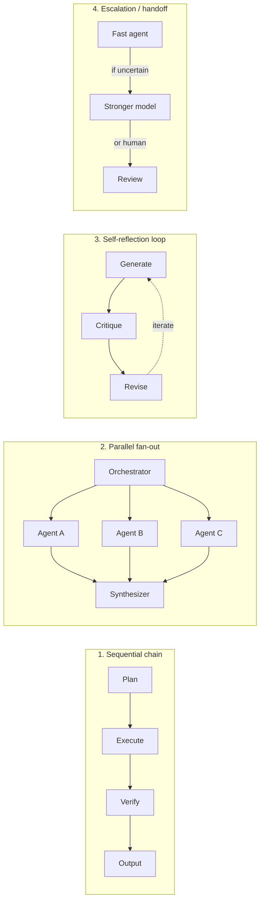

# Agentic Workflows and Multi-Agent Orchestration

This study explains two key ideas in modern AI design: agentic workflows and multi-agent orchestration.

**Agentic workflows** are systems where an AI model doesn't just give one answer. Instead, it plans, uses tools, watches results, and adjusts to finish a task. Multi-agent orchestration builds on this by having several specialised agents work together. One agent, called the orchestrator, guides the others, known as subagents.

---

## Anatomy of an Agentic Workflow

The main part of every agentic system is the **reAct loop**. Here, the model decides what to do, takes action (like using a tool or checking a database), sees the result, and repeats. This is strong because the model can fix mistakes, change plans, and do many steps without human help.

The core components of an agentic workflow are:

Multi-agent orchestration adds another layer to this.

---

## Multi-Agent Orchestration

Agentic workflows involve an AI model that doesn't just answer once. It plans, acts, uses tools, watches results, and repeats until it reaches a goal. The focus shifts from just answering questions to making decisions to reach a goal.

### Agentic Workflow Loop

The steps of **planning, acting, observing, and repeating** are central to any agent. Multi-agent systems become interesting when many of these loops run at the same time or in a hierarchy.

**Multi-agent orchestration** means getting many agents to work together towards a common goal. Each agent has its own tools and context. The key decision is how these agents connect with each other.

### Main Ideas

Common setups include:

- **Orchestrator–worker** — one agent leads many specialists
- **Pipeline** — agents work in a sequence, passing results to the next
- **Peer-to-peer / debate** — agents review each other's work

Most real systems mix these setups.

### Key Design Concerns & Topology Patterns

### Challenges in Orchestration

The challenge in orchestration is not the easy parts; it's everything else:

- Context windows can fill up if tasks take too long.
- Agents might get stuck in reasoning loops without knowing.
- Tool outputs can be unclear.
- If one agent fails, it can cause problems if there are no clear error agreements between agents.

### Trust and Permissions

Trust and permissions are important. An agent should only have the permissions it needs. For example, a research agent should not have access to write in the database. Each agent gets the trust set by the human operator, but not all agents need full trust.

---

## Practical Design Tips

- Keep agent interfaces simple — each agent should have clear input and output rules, not just free-form text.
- Include checkpoints for human review before irreversible actions (like deleting files or sending emails).
- Use explicit state (writing to a shared store) instead of relying on a previous agent's output.
- Log every tool call with its input and output — debugging is hard without traces.
- Report errors clearly — an agent that hides errors is harder to fix than one that reports them.

---

## When to Use Multi-Agent vs Single-Agent

| Scenario | Recommended Approach |
|---|---|
| Tasks with clear steps that fit the context window | Single agent |
| Tasks that can be done in parallel (e.g., researching ten topics at once) | Multi-agent |
| Tasks requiring specialization (e.g., a SQL expert vs. a generalist) | Multi-agent |
| Long tasks where one agent's context would fill up | Multi-agent |

### Why Use Multiple Agents?

A single agent has limited focus. Breaking a big task into smaller parts (like research, coding, review) allows for specialization, parallel work, and more reliable results. The orchestrator's role is to break down the goal, assign tasks, gather results, and combine them.

---

## Key Orchestration Patterns

There are four main patterns:

### 1. Sequential Chain

Each step's result is the next step's starting point. This works well for structured processes like research, drafting, editing, and publishing. It is easy to understand and fix.

### 2. Parallel Fan-Out

The main controller breaks a task into smaller tasks, runs them at the same time, and then combines the results. This is much faster than doing tasks one after another when they don't depend on each other.

### 3. Self-Reflection Loop

The same or a different model checks its own work and makes improvements. This is often used in coding and writing tasks and usually improves quality more than doing it once.

### 4. Escalation / Handoff

A simple and fast model handles easy tasks and gives harder tasks to a better model or a human. This is common in production systems to save money and time.

---

## Key Design Considerations

- **Managing context** is the hardest part. You need to decide what information each part sees and shares without going over limits.
- **Stopping conditions** are important. Loops can run forever if you don't clearly define when they should stop.
- **Trust between agents** — in systems with multiple agents, an agent should not automatically trust instructions from another agent. There are risks of harmful instructions and results.
- **Observability is crucial.** You should log every tool call, step, and handoff. Silent failures can quickly add up over many steps.

---