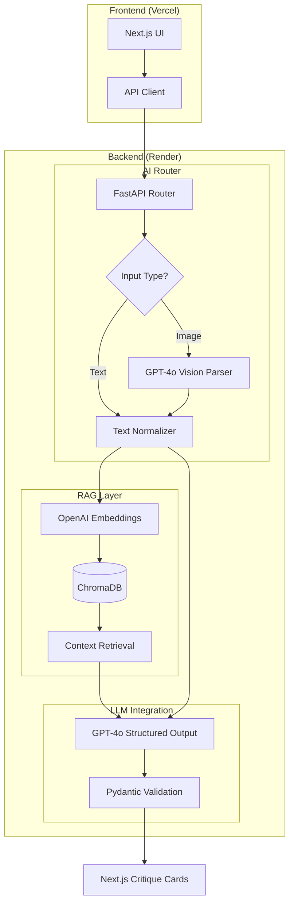

# Case Study: AI Architecture Reviewer
**Strategic AI for System Design & Consultancy**

## 1. Problem Framing
In high-growth engineering environments, architectural reviews are a critical but manual bottleneck. Senior engineers spend significant time identifying recurring anti-patterns in system designs, which can delay development cycles by days or weeks. 

The **AI Architecture Reviewer** was built to:
* **Scale Expertise:** Provide instant, high-fidelity feedback that traditionally requires a Staff Engineer's review.
* **Ensure Consistency:** Ground AI critiques in verified industry best practices rather than generic LLM hallucinations.
* **Enable Multi-modal Intake:** Support engineers who think in both diagrams (UML) and prose.
---
## 2. What This System Does
The platform acts as an automated design partner. A user uploads a system diagram (PNG/JPG) or provides a text description of their stack. The system then:
1.  **Visually Parses the Design:** Extracts components and data flows from images.
2.  **Retrieves Context:** Queries a vector database for relevant architectural patterns.
3.  **Generates Structured Critiques:** Produces a categorized report covering bottlenecks, scalability, reliability, and cost.
---
## 3. System Architecture
The following diagram illustrates the request flow from the Next.js frontend to the RAG-enabled FastAPI backend.

---
### Architecture Components:
* **Frontend (Next.js):** Hosted on Vercel, utilizing Tailwind CSS for a responsive dashboard and Lucide React for status iconography.
* **Backend (FastAPI):** Hosted on Render, managing multipart/form-data for image processing and handling asynchronous AI streams.
* **AI Router:** Directs inputs to the GPT-4o Vision API to transform visual UML diagrams into objective system summaries.
* **RAG Layer:** A persistent ChromaDB instance seeded with patterns such as Event-Driven Architecture, ML Serving, and Data Warehousing.
* **LLM Integration:** Utilizes OpenAI's Structured Outputs to guarantee the API returns a validated JSON schema.
---
## 4. Real-Time Capabilities
* **Instant Vision Parsing:** Real-time conversion of Base64-encoded images into architectural text.
* **Dynamic UI Updates:** A state-driven React frontend that provides immediate feedback during the "Consulting best practices" phase.
* **On-the-Fly Database Seeding:** The system detects an empty vector store on deployment and automatically populates it with engineering patterns.
---
## 5. Observability
* **Structured Logging:** Backend logs track the flow from image extraction to RAG retrieval and final LLM response.
* **Confidence Scoring:** Every critique includes a confidence score (1–100) based on the clarity of the input and the relevance of the retrieved data.
* **AI Reasoning Trace:** The UI displays the "AI Reasoning" behind every score, providing transparency into how the critique was formulated.
---
## 6. Limitations
* **Ephemeral Storage:** On free-tier hosting (Render), the local ChromaDB storage resets during server restarts, necessitating a re-seed of data.
* **Diagram Complexity:** Extremely dense or non-standard UML diagrams may require supplemental text descriptions for 100% accuracy.
* **Cold Starts:** Initial requests after inactivity may experience latency as the backend service wakes up.
---
## 7. Roadmap
* **Cloud Vector Database:** Migrate from local ChromaDB to a managed instance (e.g., Pinecone or MongoDB Atlas) for permanent persistence.
* **Custom Knowledge Uploads:** Allow consultancy clients to upload their own internal architecture "Gold Standards" to the RAG layer.
* **Multi-Agent Collaborative Review:** Implement a "Debate" mode where two AI agents (e.g., a "Security Architect" and a "Cost Optimizer") critique the design simultaneously.
---