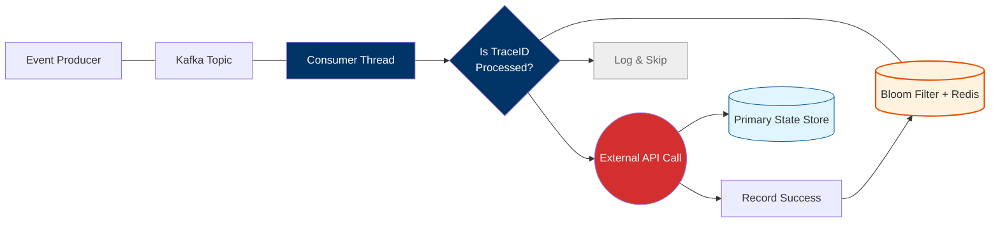

For a "Reality vs. Theory" piece, the goal is to expose the "dirty secrets" of EDA that aren't in the textbooks—like the nightmare of distributed tracing or the reality of "eventual consistency" when a stakeholder wants a "real-time" report.

# Event-Driven Architecture: The Hard Truths Beyond the Hype

In theory, Event-Driven Architecture (EDA) is the promised land of decoupling. The textbook version is simple: *Service A emits an event, Service B consumes it, and they live happily ever after in total isolation.*

In reality, we’ve seen that EDA often swaps one set of problems (tight coupling) for another (invisible complexity). If you are moving beyond 10K+ RPS, you don't just need Kafka; you need a strategy for when things go "wrong in the background."

### 1. The Theory: Total Decoupling
**The Reality: Logic Gravity**
The theory says Service A doesn't need to know who is listening. However, in complex flows, Service A often ends up having to format its event payload specifically because Service B, C, and D need certain fields to function. 
* **The Insight:** This is **"Schema Coupling."** If you change a field in your Kafka producer, you might break four downstream microservices silently. 
* **The Advanced Move:** Implement a **Schema Registry** (like Confluent or Apicurio) from day one. Treat your event schemas as strictly as your API contracts.

### 2. The Theory: Infinite Scalability
**The Reality: The "Fan-out" Bottleneck**
Textbooks show one arrow pointing to many consumers. In a high-throughput environment, if one event triggers ten downstream services, you’ve just created a **10x amplification of traffic**.
* **The Insight:** If your ingestion is 15K RPS, your downstream "fan-out" might be hitting 150K RPS. We’ve seen downstream databases melt because a "decoupled" event-driven trigger was too efficient.
* **The Advanced Move:** Use **Backpressure** and **Consumer Group Scaling**. Your consumers must be able to signal the producer to slow down, or you must implement a "Leveling Reservoir" (a buffer that absorbs spikes).

### 3. The Theory: Eventual Consistency is Fine
**The Reality: The "Where is my Data?" Support Ticket**
In theory, "eventual" is acceptable. In reality, when a user updates their profile and hits "Refresh," they expect to see the change. If your event hasn't propagated through the pipeline yet, they see old data.
* **The Insight:** Eventual consistency is a **UX problem**, not just a technical one.
* **The Advanced Move:** Use **Read-Your-Writes Consistency** patterns. We often use a "Local Overlay" technique where the UI optimistically updates the state while the background event-bus catches up, or we route the "Refresh" query to a primary store instead of the eventually consistent read-replica.

### 4. The Theory: Just "Replay" the Events
**The Reality: The Side-Effect Nightmare**
Kafka lets you "replay" from an offset. In theory, this fixes bugs. In reality, replaying an event that triggers an email or a financial transaction means **sending the email twice**.
* **The Insight:** Most developers forget about **Idempotency**.
* **The Advanced Move:** Every event must have a unique `correlation_id`. Every consumer must check this ID against a "Processed Events" cache (using something like a **Bloom Filter** or a fast Redis set) before executing a side effect.

### 5. The "Niche" Architect’s Tip: Distributed Tracing is Non-Negotiable
In a monolith, you have a stack trace. In EDA, a request dies in a "black box" between three Kafka topics and a Lambda function. 

* **The Advanced Move:** Pass a `trace_id` through every event header. We utilized **OpenTelemetry** to stitch together the "life of an event." Without it, debugging a 100ms latency spike at 15K RPS is like finding a needle in a haystack—while the haystack is on fire.

---

### 6. The Reality of Idempotency: The "Double-Gate" Pattern
In theory, you just check a database before processing. At **15K+ RPS**, your database will collapse under the weight of "read-before-write" checks.

1.  **The Probabilistic Gate (Local):** We use a **Bloom Filter** residing in the pod's RAM. It provides a near-instant answer to "Have I seen this ID before?" If it says no, we are 100% sure it's new.
2.  **The Deterministic Gate (Distributed):** If the Bloom Filter says "maybe" (handling the rare false positive), we check a distributed **Redis** set with a short TTL. 
3.  **The Side Effect:** Only after passing these gates do we hit the External API or the Primary DB. This ensures that the "Expensive" operations are only called for unique events.

**The Niche Insight**: In high-throughput environments, the "Bloom Filter" acts as a probabilistic barrier. It allows you to reject 99% of duplicates in nanoseconds without ever touching your network or disk. This is how we maintained our 15K+ RPS throughput without the "Idempotency Check" becoming the new bottleneck.

---
### 7. Troubleshooting Section: When the Theory Breaks
To make this article truly "Advanced," add a section on what happens when things go wrong:

* **Consumer Rebalancing:** When Kafka rebalances, two consumers might briefly process the same partition. Your idempotency logic must handle this "race condition" using a **Distributed Lock** (Redlock) or **Database Constraints**.
* **Bloom Filter Saturation:** As the filter fills up, false positives increase. You need a strategy to "flip" or clear the filter based on a time window or event count.
* **The DLQ Trap:** If an event is "unique" but the API call fails, don't just discard it. Move it to a **Dead Letter Queue (DLQ)** with the original `trace_id` intact so it can be safely retried without being flagged as a duplicate later.
---

### Comparison: Theory vs. Reality

| Aspect | The Textbook Theory | The Production Reality |
| :--- | :--- | :--- |
| **Coupling** | Services don't know each other. | Services are coupled by the Event Schema. |
| **Error Handling** | Events just "retried." | Retries cause "Dead Letter Queue" (DLQ) debt. |
| **Visibility** | Simple flow-charts. | Distributed tracing "Spaghetti." |
| **State** | Stateless processing. | Heavy reliance on Local State Stores (RocksDB). |

---