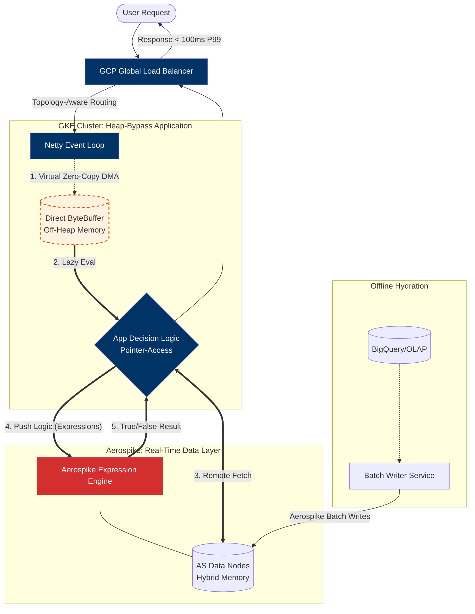

Designing a system to handle 10,000+ Requests Per Second (RPS) with sub-100ms latency is a significant engineering challenge, particularly in the high-stakes environment of AdTech. In this domain, every millisecond of delay directly impacts revenue and user experience.

At **10,000+ RPS**, the bottleneck shifts from network I/O to memory bandwidth, garbage collection (GC) pauses, and cache contention. Here is a more advanced take.

## Engineering for Ultra-High Throughput: Lessons from a 10K+ RPS AdTech Engine

In high-frequency bidding environments, "fast" is a moving target. To achieve a **sub-100ms P99** at a scale of **10,000+ RPS**, standard Spring Boot or REST patterns collapse under the weight of thread context switching and GC overhead. 

We architected a solution that prioritizes **mechanical sympathy**—aligning software design with the underlying hardware and network realities of **GCP** and **Aerospike**.

### 1. The Reactive Manifest: Backpressure and Event Loops
At 10k RPS, the "thread-per-request" model is a liability. Even with platform threads, the memory overhead and context-switching latency are prohibitive. 

* **The Niche Insight:** We implemented **Project Reactor** not just for non-blocking I/O, but to leverage **Backpressure**. By using `onBackpressureBuffer` and custom `Publishers`, we ensured that if the Aerospike cluster experienced a micro-spike in latency, the application layer would shed load or buffer intelligently rather than crashing with an `OutOfMemoryError`.
* **Netty Optimization:** We tuned the underlying Netty event loops to match the CPU core count of our GKE nodes, minimizing cross-core communication and ensuring "cache locality" for request processing.

### 2. Aerospike: Beyond Simple Key-Value Lookups
While many use Aerospike as a simple cache, we treated it as a **Real-Time Data Platform**. 

* **Hybrid Memory Architecture (HMA):** We utilized Aerospike’s ability to store **Indexes in Linux Shared Memory** and **Data on NVMe**. This allowed us to bypass the filesystem layer entirely, hitting the "bare metal" of the SSDs.
* **Bin-Level Convergence:** To handle high-velocity updates (like budget pacing), we used **Aerospike Expressions** and **CDTs (Complex Data Types)**. Instead of a Read-Modify-Write cycle—which introduces race conditions and doubles network trips—we performed atomic, server-side operations to update counters in a single 1ms RTT (Round Trip Time).

### 3. The "Silent Killer": Solving GC Pressure with Heap-Bypass
At **15K+ RPS**, the primary bottleneck isn't just network I/O; it’s the **Garbage Collection (GC) Tax**. Creating short-lived objects for every request leads to frequent "Young Gen" pauses. Even a 20ms "Stop-the-World" event causes a request pile-up that breaches a 100ms SLA.

#### The Virtual Zero-Copy Strategy
In our architecture, we couldn't use standard hardware-level `sendfile()` because data was fetched from a remote Aerospike cluster. Instead, we implemented a **Heap-Bypass** approach:

* **Direct Buffer Mapping:** We configured the Aerospike Java client to utilize **Netty’s Direct ByteBuffers**. This allows the OS to perform a DMA (Direct Memory Access) transfer from the NIC directly into off-heap memory, bypassing the JVM heap entirely for the transport layer.
* **Lazy Binary Evaluation:** Instead of the standard `read -> deserialize -> process` flow, we used **Pointer-based access**. By utilizing binary-efficient formats (like FlatBuffers or optimized Aerospike CDTs), our logic reads only the specific offsets required for a decision, avoiding the overhead of full POJO instantiation.
* **Data Gravity (Filter Expressions):** We pushed the heaviest logic to the data. By using **Aerospike Filter Expressions**, the remote node performs the initial "match/no-match" check. This reduced our network payload by **60%**, effectively achieving "Zero-Copy" by not moving the data at all when a condition wasn't met.

#### The Niche Tip: Serialization Overhaul
For the data that *did* need to reach the application layer, we eliminated reflection-based overhead. We replaced standard Jackson with **Jackson Afterburner** and moved toward **Protobuf** for internal service communication, drastically reducing the CPU cycles spent on metadata inspection.

### 4. Kubernetes Topology-Aware Routing on GCP
Standard Kubernetes Service routing is often "random," which can introduce unnecessary cross-AZ (Availability Zone) latency. 

* **The Optimization:** We implemented **Topology-Aware Hints** in GKE. This ensures that a request arriving at a Load Balancer in `us-central1-a` is routed to a pod in the same zone, which then talks to an Aerospike node in that same zone. 
* **Impact:** This shaved **5–12ms** off our tail latency simply by avoiding the "cross-zone hop" in the Google VPC.

### 5. Efficient State Injection via Batching
To keep the cache hydrated without locking, we built a **Sidecar Batcher**. Data from our upstream OLAP systems (BigQuery/Spark) was streamed into a Kafka topic and consumed by a dedicated "Writer" service.

* **The Niche Insight:** We used **Aerospike Batch Writes**. Writing 1,000 records in one network call is orders of magnitude more efficient than 1,000 individual PUTs. This kept the "Write-Load" on the SSDs low, preserving IOPS for the critical "Read-Path" of the ad-request.

---

---
### Summary Table for Architects

| Component | Standard Approach | Our High-Scale Approach | Why? |
| :--- | :--- | :--- | :--- |
| **I/O Model** | Imperative/Blocking | Reactive (Non-blocking) | Maximizes CPU utilization per core. |
| **Data Store** | Redis (RAM only) | Aerospike (HMA) | Persistence with RAM-like speed at 1/5th the cost. |
| **Network** | Cross-AZ Routing | Topology-Aware Routing | Eliminates inter-zone latency overhead. |
| **Updates** | Read-Modify-Write | Atomic Server-side Ops | Prevents race conditions and saves RTTs. |

---