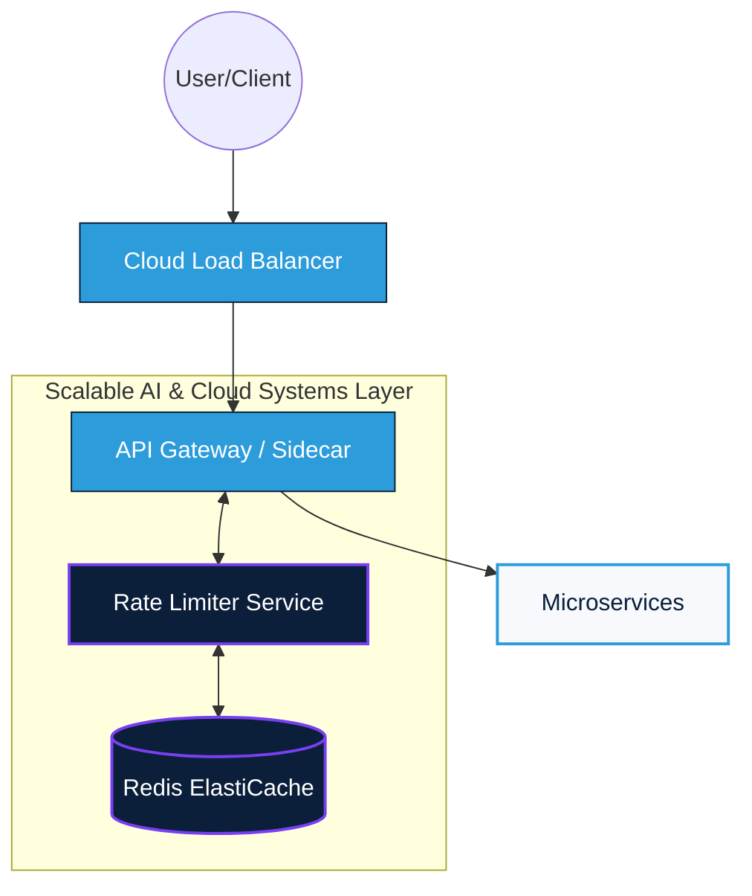
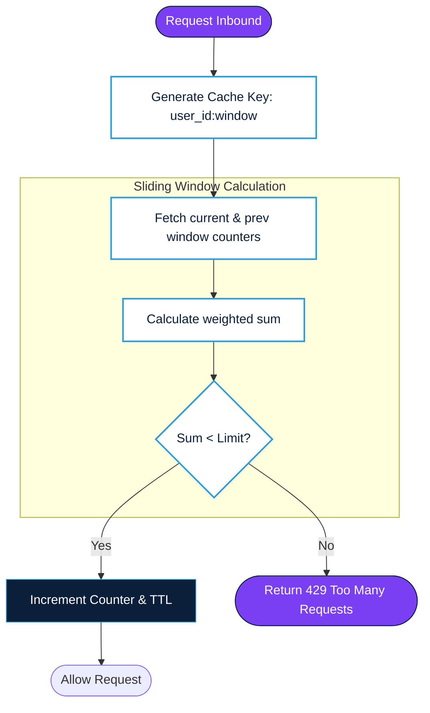

Building a robust rate limiter is a fundamental exercise in system design. It’s the "bouncer" at the door of your API, ensuring that no single user or service can overwhelm your infrastructure.

Here is a comprehensive guide to designing a cloud-native, distributed rate limiter for your blog.


## 1. Why Rate Limiting Is a First-Class System Concern

Rate limiting is not just about protecting APIs—it is about **maintaining system stability under adversarial and bursty conditions**.

At scale, uncontrolled traffic leads to:

* **Cascading failures** across microservices
* **Queue amplification** (latency → retries → more load)
* **Unfair resource distribution** (noisy neighbor problem)
* **Cost explosions** in cloud environments

In production systems (AdTech, FinTech, AI inference), rate limiting acts as a **control plane for load shaping**, not just a guardrail.

---

## 2. Requirements

Before diving into the code, we must define the boundaries of the system.

### Functional Requirements
* **Allow/Block Requests:** The system must decide in real-time if a request should be processed or throttled.
* **Support Multiple Rules:** Limits can be based on IP address, User ID, or API Key.
* **Informative Feedback:** Return standard HTTP status codes (429 Too Many Requests) and headers indicating the limit status.

### Non-Functional Requirements
* **Low Latency:** The rate limiter sits in the critical path. It must add negligible overhead (sub-millisecond).
* **High Availability:** If the rate limiter fails, it should fail open (allow requests) rather than taking down the entire system.
* **Distributed Scalability:** It must handle millions of requests across multiple geographic regions.
* **Cloud Compliance:** Must leverage managed services to reduce operational overhead.
---

## 3. Back-of-the-Envelope Estimates

Let’s put the scale into perspective:

* **Total Users:** 10 Million.
* **Daily Active Users (DAU):** 1 Million.
* **Average Requests per User/Day:** 100.
* **Total Requests per Day:** $100 \times 1,000,000 = 100,000,000$ requests.
* **Average RPS (Requests Per Second):** $\frac{100,000,000}{86,400} \approx 1,157$ RPS.
* **Peak RPS:** (Assume 5x average) $\approx 5,800$ RPS.

**Storage Requirements:**
If we store a 64-bit counter and a 64-bit timestamp per user:
* $16 \text{ bytes per user} \times 10 \text{ million users} = 160 \text{ MB}$.
Even with metadata and keys, this easily fits into a small **Redis** instance.

---
## 4. API Design

The rate limiter is usually an internal component, but it should expose a consistent interface for the API Gateway or Sidecars.

**Internal Check Request:**
`POST /v1/is-allowed`
* **Payload:** `{ "key": "user_123", "limit": 100, "window": 60 }`
* **Response:** `200 OK` (Allowed) or `429 Too Many Requests` (Blocked).

**Response Headers (returned to the End-User):**
* `X-Ratelimit-Limit`: Total requests allowed in the window.
* `X-Ratelimit-Remaining`: Remaining requests in the current window.
* `X-Ratelimit-Retry-After`: Seconds to wait before retrying.

---

## 5. Algorithms Comparison

Choosing the right algorithm is a trade-off between memory and accuracy.

### Fixed Window Counter
* Simple, fast (O(1))
* Problem: **burst at window boundaries**

**Production note:**
Used widely with **jitter/randomization** to reduce synchronized bursts.

---
### Sliding Window Log
* High accuracy
* Stores timestamps per request

**Failure mode:**
* Memory explosion at scale (e.g., 1M users × 100 requests = 100M entries)

---
### Sliding Window Counter (Hybrid)
* Approximation of sliding window
* Lower memory footprint

**Trade-off:**
* Slight accuracy loss vs major performance gain
---

### Token Bucket (Most Practical)
* Supports bursts
* Smooth refill rate

**Hidden issue (rarely discussed):**
* In distributed setups, **clock drift + network latency** causes token inconsistency
> In systems with >2ms network RTT, token bucket precision degrades unless tokens are batched or pre-allocated.
---
### Leaky Bucket

* Enforces steady output rate
* Good for **downstream protection (queues, DBs)**


| Algorithm | Pros | Cons |
| :--- | :--- | :--- |
| **Token Bucket** | Memory efficient; allows bursts. | Challenging to tune in distributed systems. |
| **Leaky Bucket** | Smooths out requests; stable rate. | Bursts are discarded; can increase latency. |
| **Fixed Window** | Simplest to implement. | "Spikes" at window edges can allow 2x traffic. |
| **Sliding Window Log** | Extremely accurate. | High memory usage (stores every timestamp). |
| **Sliding Window Counter** | High accuracy; low memory. | Slightly more complex logic. |

---

---

## 6. High-Level & Low-Level Design

In a cloud-compliant architecture, we place the Rate Limiter at the **API Gateway** level or as a **Sidecar** to avoid extra network hops.

### High-Level Architecture

### Key Components

#### 1. API Gateway (Control Point)

* Centralized enforcement
* Reduces load on backend services

#### 2. Rate Limiter Service

* Stateless compute layer
* Executes algorithm logic

#### 3. Distributed Cache (Redis)

* Stores counters/tokens
* Enables horizontal scaling

#### 4. Observability Layer

* Metrics: reject rate, latency, burst patterns
* Critical for tuning



### Low-Level Logic (Sliding Window Counter)
When a request arrives:
1.  Fetch the counter for the current and previous minute.
2.  Calculate the weight based on the current timestamp.
3.  $Count = \text{current\_window} + \text{previous\_window} \times (1 - \text{overlap\_percentage})$
4.  If $Count < Limit$, increment and allow; else, block.



---

## 7. Storage & Data Model

For a cloud-native approach, **Redis** (AWS ElastiCache, Azure Cache for Redis, or Google Memorystore) is the gold standard because it supports:
* **In-memory speed.**
* **Atomic operations** (`INCR`, `EXPIRE`).
* **TTL (Time-To-Live)** for automatic cleanup.

### Data Model
* **Key:** `rate_limit:<user_id>:<window_id>`
* **Value:** `integer (counter)`
* **Policy:** Set TTL equal to the window size (e.g., 60 seconds).

---

## 8. Scaling Strategies (What Actually Works)

### 8.1 Sharding

* Hash-based partitioning across Redis nodes
* Prevents hotspotting

**Failure mode:**

* Uneven key distribution → one shard overloaded

**Mitigation:**

* Use **consistent hashing + virtual nodes**

---

### 8.2 Local + Global Hybrid Limiting

This is what most “textbook designs” miss.

#### Approach:

* Local in-memory limiter (fast, approximate)
* Global Redis limiter (accurate, slower)

**Why this matters:**

* Reduces Redis load by ~70–90%
* Handles ultra-low latency use cases

---

### 8.3 Multi-Region Deployment

**Problem:**

* Cross-region latency breaks consistency

**Solutions:**

* Region-local limits (preferred)
* Global limits only for critical APIs

---
## 9. Failure Modes

### 9.1 Redis Failure

**What naive systems do:**

* Fail closed → block all traffic ❌

**Production approach:**

* Fail open with safeguards:

  * Temporary local limits
  * Circuit breaker activation

---

### 9.2 Network Partition

* Leads to **split-brain rate limiting**
* Users may exceed limits

**Mitigation:**

* Accept temporary inconsistency
* Log + reconcile later

---

### 9.3 Clock Drift

* Affects token refill logic

**Mitigation:**

* Use monotonic clocks
* Or server-side timestamping

---

### 9.4 Retry Storms

Rate limiting often *causes* retries.

**Chain reaction:**

```
Rate limit → client retry → more load → more rate limiting
```

**Fix:**

* Enforce **exponential backoff + jitter**
* Return proper headers:

  * `Retry-After`

---

### 9.5 Hot Keys

* Popular users or endpoints overload single Redis key

**Solution:**

* Key bucketing:

```
user:123 → user:123:bucket1, bucket2...
```

---
## 10. Trade-offs & Cloud Considerations (Principal-Level View)

### Consistency vs. Latency
In a globally distributed app, do you sync Redis across regions?
* **Local Strategy:** Each region has its own Redis. Lower latency, but a user could potentially "double" their limit by hitting two regions.
* **Global Strategy:** Centralized Redis. Higher latency due to cross-region calls, but strict limit enforcement.
* *Verdict:* Most cloud-compliant designs prefer **Local Strategy** for performance.

### Race Conditions
In a high-concurrency environment, two requests might read the same counter before either increments it. 
* **Solution:** Use **Lua scripts** in Redis to ensure the "Read-Modify-Write" cycle is atomic.

### Resilience
If Redis goes down, the rate limiter shouldn't kill the API.
* **Solution:** Implement a **fail-open** mechanism where the system defaults to "Allow" if the cache is unreachable, supplemented by secondary monitoring alerts.


| Dimension   | Option A | Option B    | Reality               |
| :----------- | :-------- | :----------- | :--------------------- |
| Consistency | Strong   | Eventual    | Eventual wins         |
| Accuracy    | High     | Approximate | Approximate is enough |
| Latency     | Low      | Medium      | Must stay less than 5ms        |
| Complexity  | High     | Moderate    | Keep it operable      |

---

## 11. Observability & Control (Often Ignored)

Track:

* Rejection rate per tenant
* Burst patterns
* Latency impact
* Redis saturation

**Advanced insight:**
Rate limiting is a **feedback control system**.
Without observability, you are blind to:

* Over-throttling (lost revenue)
* Under-throttling (system risk)

---
## 12. What Breaks at Scale (Hard Truths)

* Perfect accuracy is **not achievable** in distributed systems
* Centralized rate limiting becomes a bottleneck beyond ~1M RPS
* Redis latency becomes dominant after ~2–3ms
* Most systems **over-engineer algorithms, under-engineer failure handling**

---
## 13. Our Perspective — Scalable AI & Cloud Systems

In AI-driven systems (LLMs, inference APIs):

* Rate limiting is used for:
  * **Cost control (GPU usage)**
  * **Fair usage across tenants**
  * **Preventing prompt flooding attacks**

### Advanced Pattern:
**Dynamic Rate Limiting**
* Adjust limits based on:
  * System load
  * User tier
  * Model cost (GPT-4 vs smaller models)

---
## 14. Final Recommendation

If you’re building a production-grade system:

👉 Start with:

* Token bucket + Redis
* API Gateway enforcement

👉 Evolve to:

* Hybrid local + global limiting
* Sharded Redis cluster
* Observability-driven tuning

👉 Avoid:

* Over-optimizing algorithm before handling failures
* Strong consistency assumptions

---

## 15. Read-Time Optimized Summary

* Rate limiting is a **system stability mechanism**, not just API protection
* Use **approximate + distributed approaches**
* Design for **failures first, accuracy second**
* Add **observability and adaptive control**