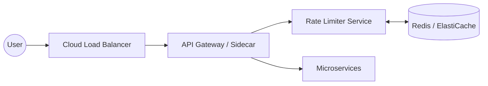

## 1. Requirements

Before diving into the code, we must define the boundaries of the system.

### Functional Requirements
* **Allow/Block Requests:** The system must decide in real-time if a request should be processed or throttled.
* **Support Multiple Rules:** Limits can be based on IP address, User ID, or API Key.
* **Informative Feedback:** Return standard HTTP status codes (429 Too Many Requests) and headers indicating the limit status.

### Non-Functional Requirements
* **Low Latency:** The rate limiter sits in the critical path. It must add negligible overhead (sub-millisecond).
* **High Availability:** If the rate limiter fails, it should fail open (allow requests) rather than taking down the entire system.
* **Distributed Scalability:** It must handle millions of requests across multiple geographic regions.
* **Cloud Compliance:** Must leverage managed services to reduce operational overhead.

---

## 2. Back-of-the-Envelope Estimates

Let’s put the scale into perspective:

* **Total Users:** 10 Million.
* **Daily Active Users (DAU):** 1 Million.
* **Average Requests per User/Day:** 100.
* **Total Requests per Day:** $100 \times 1,000,000 = 100,000,000$ requests.
* **Average RPS (Requests Per Second):** $\frac{100,000,000}{86,400} \approx 1,157$ RPS.
* **Peak RPS:** (Assume 5x average) $\approx 5,800$ RPS.

**Storage Requirements:**
If we store a 64-bit counter and a 64-bit timestamp per user:
* $16 \text{ bytes per user} \times 10 \text{ million users} = 160 \text{ MB}$.
Even with metadata and keys, this easily fits into a small **Redis** instance.

---

## 3. API Design

The rate limiter is usually an internal component, but it should expose a consistent interface for the API Gateway or Sidecars.

**Internal Check Request:**
`POST /v1/is-allowed`
* **Payload:** `{ "key": "user_123", "limit": 100, "window": 60 }`
* **Response:** `200 OK` (Allowed) or `429 Too Many Requests` (Blocked).

**Response Headers (returned to the End-User):**
* `X-Ratelimit-Limit`: Total requests allowed in the window.
* `X-Ratelimit-Remaining`: Remaining requests in the current window.
* `X-Ratelimit-Retry-After`: Seconds to wait before retrying.

---

## 4. Algorithms Comparison

Choosing the right algorithm is a trade-off between memory and accuracy.

| Algorithm | Pros | Cons |
| :--- | :--- | :--- |
| **Token Bucket** | Memory efficient; allows bursts. | Challenging to tune in distributed systems. |
| **Leaky Bucket** | Smooths out requests; stable rate. | Bursts are discarded; can increase latency. |
| **Fixed Window** | Simplest to implement. | "Spikes" at window edges can allow 2x traffic. |
| **Sliding Window Log** | Extremely accurate. | High memory usage (stores every timestamp). |
| **Sliding Window Counter** | High accuracy; low memory. | Slightly more complex logic. |

---

## 5. High-Level & Low-Level Design

In a cloud-compliant architecture, we place the Rate Limiter at the **API Gateway** level or as a **Sidecar** to avoid extra network hops.

### High-Level Architecture

### Low-Level Logic (Sliding Window Counter)
When a request arrives:
1.  Fetch the counter for the current and previous minute.
2.  Calculate the weight based on the current timestamp.
3.  $Count = \text{current\_window} + \text{previous\_window} \times (1 - \text{overlap\_percentage})$
4.  If $Count < Limit$, increment and allow; else, block.

---

## 6. Storage & Data Model

For a cloud-native approach, **Redis** (AWS ElastiCache, Azure Cache for Redis, or Google Memorystore) is the gold standard because it supports:
* **In-memory speed.**
* **Atomic operations** (`INCR`, `EXPIRE`).
* **TTL (Time-To-Live)** for automatic cleanup.

### Data Model
* **Key:** `rate_limit:<user_id>:<window_id>`
* **Value:** `integer (counter)`
* **Policy:** Set TTL equal to the window size (e.g., 60 seconds).

---

## 7. Trade-offs & Cloud Considerations

### Consistency vs. Latency
In a globally distributed app, do you sync Redis across regions?
* **Local Strategy:** Each region has its own Redis. Lower latency, but a user could potentially "double" their limit by hitting two regions.
* **Global Strategy:** Centralized Redis. Higher latency due to cross-region calls, but strict limit enforcement.
* *Verdict:* Most cloud-compliant designs prefer **Local Strategy** for performance.

### Race Conditions
In a high-concurrency environment, two requests might read the same counter before either increments it. 
* **Solution:** Use **Lua scripts** in Redis to ensure the "Read-Modify-Write" cycle is atomic.

### Resilience
If Redis goes down, the rate limiter shouldn't kill the API.
* **Solution:** Implement a **fail-open** mechanism where the system defaults to "Allow" if the cache is unreachable, supplemented by secondary monitoring alerts.

---