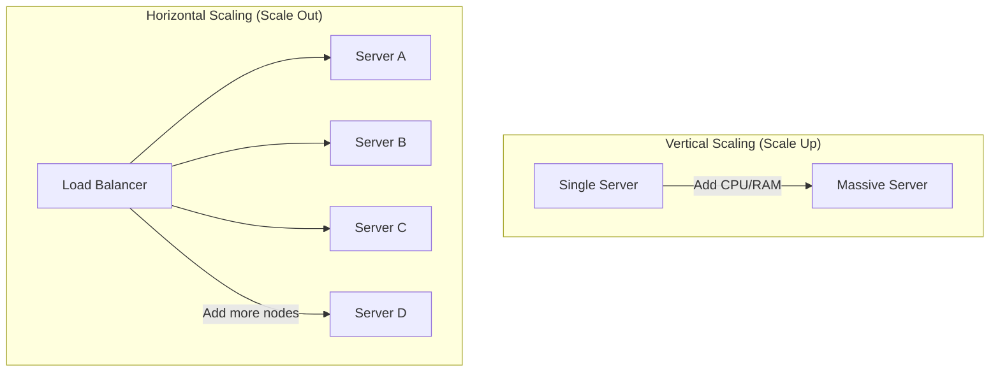
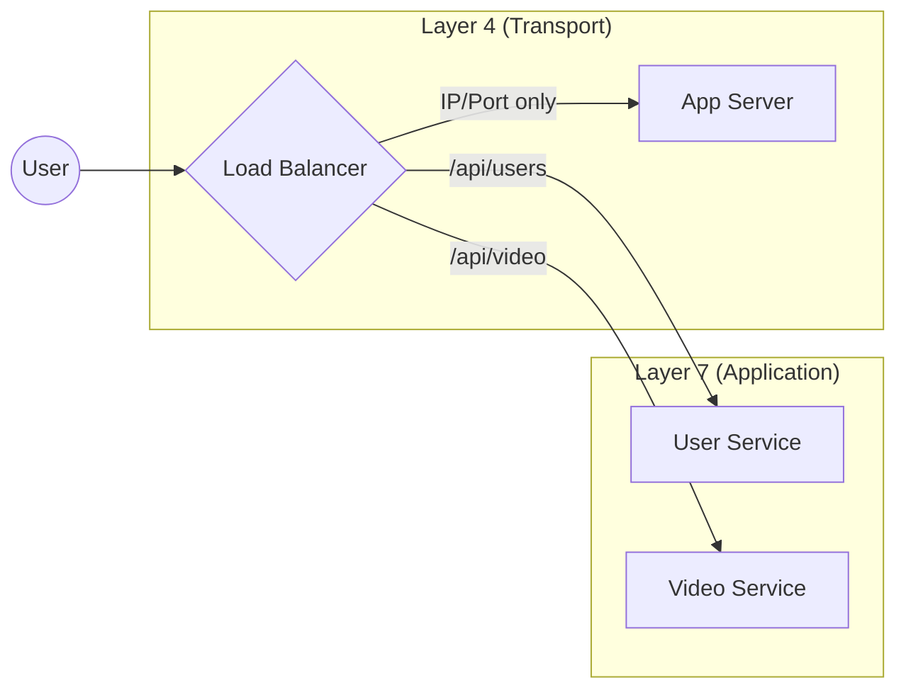
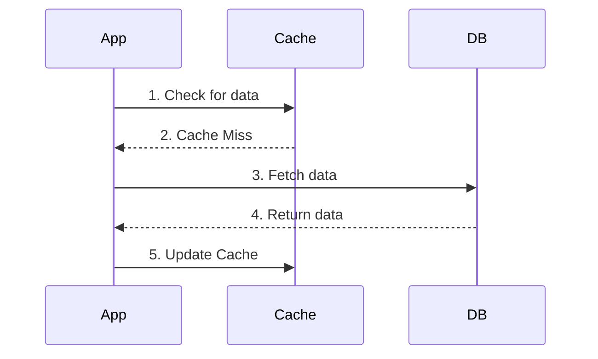
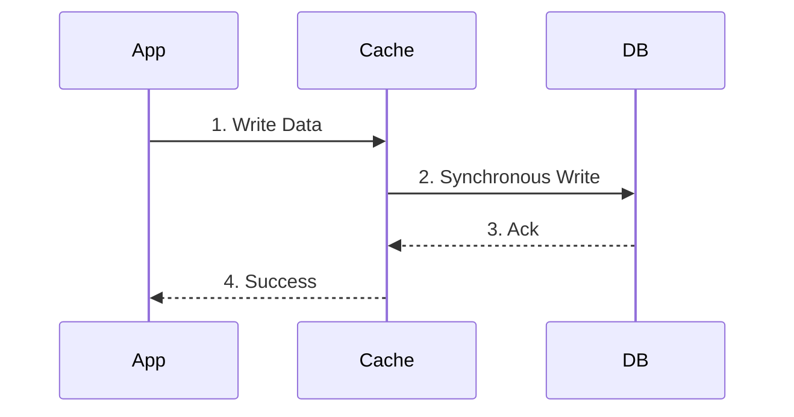
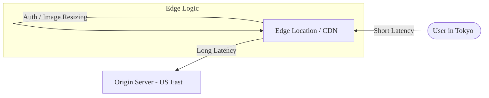

# The Scalability Blueprint

Scaling isn't just about handling more users; it’s about handling growth without your infrastructure (or your budget) collapsing. Most engineers start by throwing more hardware at the problem, but true scalability is a design philosophy.

## 1. Vertical vs. Horizontal Scaling: The "Bigger Truck" Problem
When your server starts sweating under the load, you have two choices:

* **Vertical Scaling (Scaling Up):** This is the "buy a bigger engine" approach. You add more CPU, RAM, or SSD to your existing machine. It’s simple—no code changes required. But you eventually hit a "hardware ceiling," and more importantly, you still have a **Single Point of Failure**. If that one massive server dies, your entire business goes dark.
* **Horizontal Scaling (Scaling Out):** Instead of one giant server, you use a fleet of smaller, cheaper machines. This is the gold standard for modern distributed systems. It offers infinite theoretical room to grow, but it introduces complexity: you now need a way to distribute traffic across these nodes.

## 2. Load Balancing: L4 vs. L7
If you’re scaling horizontally, the Load Balancer (LB) is your traffic cop. But not all traffic cops look at the same data.

* **Layer 4 (Transport Layer):** The LB only looks at IP addresses and ports. It doesn't care if the request is for a profile picture or a checkout page; it just shuffles packets. It’s incredibly fast and efficient because it never "opens" the data packet.
* **Layer 7 (Application Layer):** This is "smart" routing. The LB looks at the actual HTTP header, cookies, or URL path. You can route `/api/video` to one set of servers and `/api/users` to another. It’s more resource-intensive than L4 but allows for sophisticated microservices architectures.

## 3. Caching: Saving Your Database’s Life
The database is almost always your biggest bottleneck. Caching allows you to store frequently accessed data in memory (like Redis) so you don't have to hit the disk every time.

**How you implement it matters:**
* **Cache-Aside:** The most common. The application looks at the cache; if the data isn't there (a "miss"), it grabs it from the DB and updates the cache. It’s resilient but can lead to data staleness.

* **Write-Through:** Data is written to the cache and the DB simultaneously. Your cache is always up to date, but writes are slightly slower because you’re hitting two places at once.

* **Write-Back:** Data is written to the cache only, and the DB is updated after a delay. This makes writes lightning-fast, but if the cache crashes before the DB syncs, you lose data. **Use this for high-write loads where 100% durability isn't the primary concern (like like-counts or real-time metrics).**

## 4. CDN and Edge Computing: Defeating Physics
Latency is often a distance problem. If your server is in Virginia and your user is in Tokyo, the speed of light is your enemy. 

* **CDN (Content Delivery Network):** This caches static assets (JS, CSS, Images) at "Edge" locations physically close to the user. 
* **Edge Computing:** This takes it a step further. Instead of just caching files, you run actual logic (like authentication or image resizing) at the edge. By the time a request even reaches your main data center, half the work is already done.

---

## The Bottom Line
Scalability is a game of trade-offs. Horizontal scaling gives you reliability but adds networking headaches. Caching saves your DB but introduces data consistency issues. The goal isn't to build the "perfect" system, but the one that fails gracefully under the weight of its own success.

---
